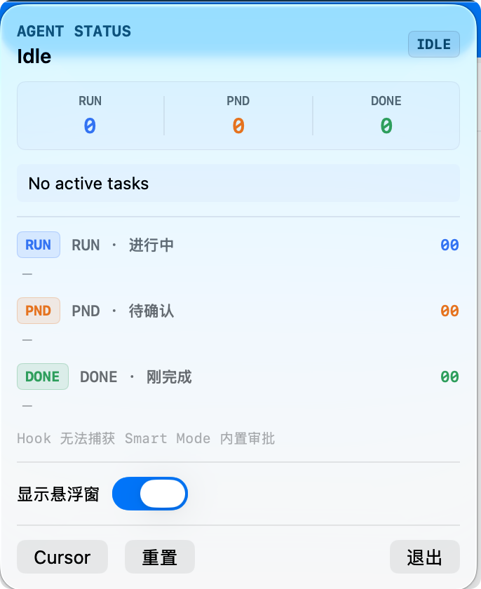
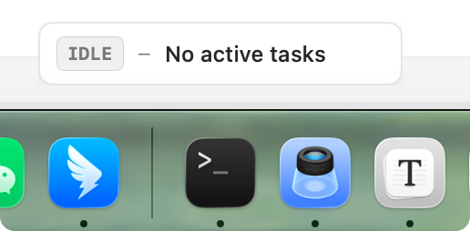

# Cursor Agent Status

macOS 菜单栏应用，通过 [Cursor Hooks](https://cursor.com/docs/agent/hooks) 实时展示本地 Cursor Agent 的工作状态。

不侵入 Cursor 本体，不占用 Dock——在菜单栏一眼看到 Agent 是否在跑、是否在等你确认、刚刚完成了什么。

📖 **详细使用说明（中文）**：[docs/使用手册.md](docs/使用手册.md)

---

## 截图

### 菜单栏下拉面板



- `RUN / PND / DONE` 三列指标与分区任务列表
- **显示悬浮窗** 开关（默认开启，启动后自动显示）
- 快捷操作：打开 Cursor、重置状态、退出

### 悬浮 HUD



- 每个活跃 Agent **独立一个悬浮窗**（多会话并排显示）
- 第一行：**Agent 名称**（与 Cursor 侧边栏聊天标题一致）
- 第二行：**当前状态** + **步骤耗时**（如 `12秒`）
- 有进行中任务时显示停止按钮（发送 ⌘⇧⌫ 到 Cursor）
- 默认 Dock 上方水平居中，可拖动

---

## 功能概览

| 模块 | 说明 |
|------|------|
| **菜单栏图标** | SF Symbol 状态图标 + 进行中任务红色角标 |
| **下拉面板** | RUN / PND / DONE 指标、状态摘要、分区任务列表 |
| **悬浮 HUD** | 按 Agent 分窗；名称 + 思考/探索/工具状态 + 计时 |
| **Hooks 桥接** | 15 种事件写入本地日志，Mac 应用实时监听 |
| **自动清理** | 过期任务自动淡出，支持手动重置残留状态 |

### 三种任务状态

| 状态 | 标签 | 含义 |
|------|------|------|
| 进行中 | `RUN` | Agent 会话、工具调用、Subagent、思考/处理中 |
| 待确认 | `PND` | Agent 回复后等待输入；Shell/MCP 批准流程相关 |
| 刚完成 | `DONE` | 最近 60 秒内结束的任务（显示 Hook `summary`） |

### 菜单栏图标

| 图标 | 条件 |
|------|------|
| `sparkles` | 空闲 |
| `arrow.triangle.2.circlepath` | 有进行中的任务（角标显示数量） |
| `hand.raised.fill` | 有待确认项 |

### 悬浮窗（HUD）

| 项目 | 说明 |
|------|------|
| **多 Agent** | 每个进行中的会话各一个窗口，Dock 上方水平并排 |
| **第一行** | Agent 名称，来自 Cursor `composer.composerHeaders` |
| **第二行** | 思考摘要 / `Exploring · …` / 工具状态，末尾显示步骤耗时 |
| **思考内容** | 来自 Hook `afterAgentThought`，工具执行期间仍保留显示 |
| **完成态** | 仅显示 Hook `summary`，不显示「Agent 任务完成」等固定文案 |
| **布局** | 宽度 200–400px；`RUN/PND/DONE` 标签固定宽度不被压缩 |
| **停止** | 进行中时显示红色 ■，向 Cursor 发送 ⌘⇧⌫ |

### 下拉面板

- 顶部状态标签 + `RUN / PND / DONE` 三列指标
- 当前状态摘要行
- 三个分区任务列表（各最多 5 条，可点击打开 transcript）
- **显示悬浮窗** 开关（持久化，默认开启）
- 快捷操作：打开 Cursor、重置状态、退出

---

## 系统要求

- macOS 14.0+
- [Cursor](https://cursor.com)（本地 IDE Agent）
- Python 3（系统自带即可，Hooks 脚本使用）
- Xcode 15+（自行编译时需要）

---

## 快速开始

### 1. 安装 Hooks

```bash
git clone <your-repo-url> cursor-agent-status
cd cursor-agent-status

chmod +x scripts/install-hooks.sh hooks/status-bridge.sh hooks/status-bridge.py
./scripts/install-hooks.sh
```

脚本会：

1. 安装 `~/.cursor/hooks/status-bridge.sh` 与 `status-bridge.py`
2. 合并或创建 `~/.cursor/hooks.json`（已有配置会先备份）
3. 创建数据目录 `~/.cursor/agent-status/`

**安装后请重启 Cursor**，或保存 `hooks.json` 以重新加载 Hooks。

### 2. 构建并运行 Mac 应用

**Xcode（推荐）**

```bash
open CursorAgentStatus.xcodeproj
# ⌘R 运行，或 Product → Archive 打包
```

**命令行**

```bash
xcodebuild -project CursorAgentStatus.xcodeproj \
  -scheme CursorAgentStatus \
  -configuration Release \
  build
```

构建完成后打开 DerivedData 中的 `CursorAgentStatus.app`，或拖入「应用程序」文件夹。

> **更新代码后**请重新执行 `./scripts/install-hooks.sh` 并重启 App，否则悬浮窗可能仍是旧行为。

### 3. 验证安装

```bash
./scripts/verify-integration.sh
```

在 Cursor 中触发一次 Agent 操作，同时观察：

```bash
tail -f ~/.cursor/agent-status/events.jsonl
```

有新行写入即表示 Hooks 工作正常。验证思考内容是否捕获：

```bash
tail -f ~/.cursor/agent-status/events.jsonl | grep afterAgentThought
```

---

## 架构

```
Cursor Agent 事件
       │
       ▼
~/.cursor/hooks/status-bridge.sh   ← Shell 入口，返回 { "permission": "allow" }
       │
       ▼
~/.cursor/hooks/status-bridge.py   ← 归一化 JSON，写入事件日志
       │
       ▼
~/.cursor/agent-status/events.jsonl
       │
       ▼
CursorAgentStatus.app              ← FSEvents + 200ms 轮询
       │
       ├── 菜单栏图标 + 下拉面板
       └── 悬浮 HUD（按 conversationId 多窗）
              └── ComposerNameResolver ← 读取 Cursor 聊天标题
```

### 监听的 Hook 事件

| 事件 | 用途 |
|------|------|
| `beforeSubmitPrompt` | 用户发送指令，立即显示「处理中」 |
| `afterAgentThought` | Agent 思考摘要（悬浮窗第二行优先展示） |
| `sessionStart` / `sessionEnd` | 会话生命周期 |
| `preToolUse` / `postToolUse` / `postToolUseFailure` | 工具调用 |
| `subagentStart` / `subagentStop` | 子代理（Explore 显示为 `Exploring`） |
| `beforeShellExecution` / `afterShellExecution` | Shell 执行 |
| `beforeMCPExecution` / `afterMCPExecution` | MCP 执行 |
| `stop` | Agent 循环结束（写入 summary） |
| `afterAgentResponse` | Agent 回复完成 |

### 自动过期（防止残留「假进行中」）

| 类型 | TTL |
|------|-----|
| 工具 / Subagent | 90 秒无更新 |
| Shell / MCP 待确认 | 60 秒无更新 |
| 会话 | 3 分钟无新事件 |
| 刚完成 | 60 秒后淡出 |

---

## 项目结构

```
cursor-agent-status/
├── assets/                     # 截图等资源
├── CursorAgentStatus/          # SwiftUI macOS 应用
│   ├── CursorAgentStatusApp.swift
│   ├── Controllers/            # 多悬浮窗控制（FloatingPanelController）
│   ├── Models/                 # 事件与任务模型
│   ├── Services/               # StatusStore、EventTailer、ComposerNameResolver
│   └── Views/                  # 菜单栏、悬浮窗、主题组件
├── hooks/
│   ├── hooks.json              # Hook 配置模板
│   ├── status-bridge.sh
│   └── status-bridge.py
├── scripts/
│   ├── install-hooks.sh        # 安装 Hooks 到 ~/.cursor
│   ├── verify-integration.sh   # 集成验证
│   └── generate-xcodeproj.sh   # 重新生成 Xcode 工程
└── docs/
    └── 使用手册.md              # 完整中文手册
```

---

## 已知限制

- **仅覆盖本地 IDE Agent** — Cloud Agent（cursor.com/agents）运行在远程 VM，不会触发用户级 `~/.cursor/hooks.json`
- **Smart Mode 内置审批** — Cursor 内置审批 UI 不一定经过 Hook，部分待确认状态可能无法捕获
- **深链跳转** — 点击任务会尝试打开 transcript 文件，尚不支持直接跳转到 Cursor 对应对话
- **停止按钮** — 通过模拟 ⌘⇧⌫ 取消当前前台 Cursor 生成，已运行的终端进程可能不会立即停止
- **Agent 名称** — 依赖 Cursor 本地状态库 `state.vscdb`，Cursor 大版本升级后路径或字段可能变化

---

## 常见问题

**菜单栏找不到图标？**

应用不显示在 Dock。检查是否在运行：`pgrep -l CursorAgentStatus`，或查看菜单栏右侧 `>>` 折叠区。

**Agent 在工作但计数为 0？**

1. 确认 Hooks 已安装：`grep status-bridge ~/.cursor/hooks.json`
2. 重启 Cursor
3. 观察 `~/.cursor/agent-status/events.jsonl` 是否有新事件
4. 重启 CursorAgentStatus 应用

**悬浮窗没有显示思考内容？**

1. 确认 Hook 有写入：`grep afterAgentThought ~/.cursor/agent-status/events.jsonl | tail -1`
2. 重新安装 Hooks：`./scripts/install-hooks.sh` 并重启 Cursor
3. 重新编译并启动 App（旧版会显示文件名而非思考摘要）

**多个 Agent 只看到一个悬浮窗？**

确认已运行最新编译的 App；每个 UUID 格式的 `conversationId` 对应独立窗口，测试/demo 会话会被过滤。

**重启 Cursor 后仍有大量「进行中」？**

点击下拉面板中的 **重置**，或等待 TTL 自动清理（1~3 分钟）。

**悬浮窗没有自动出现？**

检查下拉面板中的 **显示悬浮窗** 开关是否开启（默认开启）。

---

## 开发

```bash
# Debug 构建
xcodebuild -project CursorAgentStatus.xcodeproj \
  -scheme CursorAgentStatus \
  -configuration Debug \
  build

# 更新 Hooks 与 App 后
./scripts/install-hooks.sh
pkill -x CursorAgentStatus; open DerivedData/.../CursorAgentStatus.app
```

主要技术栈：SwiftUI · `@Observable` · FSEvents · SQLite3 · Python 3 · Cursor Hooks

---

## 相关路径

| 路径 | 说明 |
|------|------|
| `~/.cursor/hooks.json` | Hook 配置 |
| `~/.cursor/hooks/status-bridge.sh` | Hook 入口 |
| `~/.cursor/hooks/status-bridge.py` | 事件归一化 |
| `~/.cursor/agent-status/events.jsonl` | 事件日志 |
| `~/Library/Application Support/Cursor/User/globalStorage/state.vscdb` | Cursor 聊天标题（Agent 名） |

---

## License

[MIT License](LICENSE) — 可自由使用、修改、分发与商用，保留版权声明即可。
